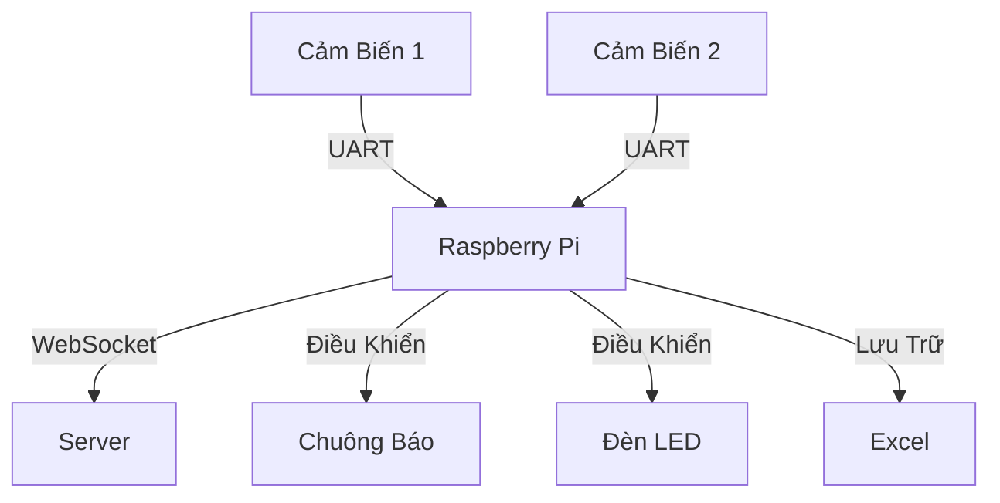

# 🎣 Ứng Dụng Quang Trắc Cá Tầm

<div align="center">
  
</div>

## 📋 Mục Lục
- [Tổng Quan](#-tổng-quan)
- [Tính Năng Chính](#-tính-năng-chính)
- [Cấu Trúc Hệ Thống](#-cấu-trúc-hệ-thống)
- [Cài Đặt](#-cài-đặt)
- [Giao Diện](#-giao-diện)

## 🌟 Tổng Quan
Hệ thống giám sát chất lượng nước trong bể cá tầm, sử dụng các cảm biến để theo dõi và cảnh báo khi có bất thường.

## 🚀 Tính Năng Chính

### 📊 Giám Sát Thời Gian Thực
- **Theo dõi dữ liệu từ 2 cảm biến độc lập**: Ứng dụng có khả năng theo dõi và hiển thị dữ liệu từ hai cảm biến khác nhau, giúp người dùng dễ dàng theo dõi tình trạng nước trong bể cá.
- **Hiển thị giá trị đo được theo thời gian thực**: Dữ liệu từ cảm biến được cập nhật liên tục, cho phép người dùng theo dõi tình trạng nước ngay lập tức.
- **Tính toán giá trị trung bình mỗi 10 lần đo**: Ứng dụng tự động tính toán và hiển thị giá trị trung bình của các lần đo, giúp người dùng có cái nhìn tổng quan về chất lượng nước.

### ⚠️ Hệ Thống Cảnh Báo
- **Chuông báo khi phát hiện nước đục**: Khi cảm biến phát hiện nước đục, chuông sẽ tự động được kích hoạt để cảnh báo người dùng.
- **Đèn LED cảnh báo**: Đèn LED sẽ sáng lên khi:
  - Pin cảm biến yếu (<15%)
  - Cảm biến mất kết nối
  - Phát hiện nước đục

### 🔄 Xử Lý Dữ Liệu
- **Lưu trữ dữ liệu vào Excel theo ngày**: Dữ liệu từ cảm biến được lưu trữ vào file Excel hàng ngày, giúp người dùng dễ dàng theo dõi và phân tích.
- **Tự động tính toán giá trị đột biến**: Ứng dụng tự động phát hiện và tính toán các giá trị đột biến trong dữ liệu, giúp người dùng nhận biết các vấn đề nhanh chóng.
- **Phát hiện và xử lý mất kết nối**: Hệ thống có khả năng tự động phát hiện khi cảm biến mất kết nối và thông báo cho người dùng.

### 🛠️ Quản Lý Thiết Bị
- **Cài đặt ngưỡng cảnh báo cho từng cảm biến**: Người dùng có thể tùy chỉnh ngưỡng cảnh báo cho từng cảm biến, giúp tối ưu hóa việc giám sát.
- **Điều khiển thời gian vệ sinh cảm biến**: Ứng dụng cho phép người dùng thiết lập thời gian vệ sinh cho cảm biến, đảm bảo cảm biến luôn hoạt động hiệu quả.
- **Giám sát pin của các cảm biến**: Hệ thống sẽ theo dõi tình trạng pin của các cảm biến và cảnh báo khi pin yếu.

### 🌐 Kết Nối
- **Giao tiếp UART với các cảm biến**: Ứng dụng sử dụng giao thức UART để giao tiếp với các cảm biến, đảm bảo truyền tải dữ liệu ổn định.
- **Kết nối WebSocket với server**: Ứng dụng có khả năng kết nối với server qua WebSocket, cho phép truyền tải dữ liệu theo thời gian thực.
- **Tự động kết nối lại khi mất kết nối**: Hệ thống sẽ tự động cố gắng kết nối lại với cảm biến khi mất kết nối, đảm bảo không bị gián đoạn trong quá trình giám sát.

## 🔧 Cấu Trúc Hệ Thống



## 💻 Giao Diện
- **Hiển thị trạng thái cảm biến**: Giao diện người dùng hiển thị trạng thái hiện tại của các cảm biến, giúp người dùng dễ dàng theo dõi.
- **Biểu đồ theo dõi dữ liệu**: Ứng dụng cung cấp biểu đồ để người dùng có thể theo dõi sự thay đổi của dữ liệu theo thời gian.
- **Bảng điều khiển cài đặt**: Người dùng có thể dễ dàng điều chỉnh các cài đặt của cảm biến thông qua bảng điều khiển.
- **Nút xuất dữ liệu Excel**: Ứng dụng cho phép người dùng xuất dữ liệu ra file Excel một cách dễ dàng.

<div align="center">
  
</div>

## 🔌 Cài Đặt
1. Cài đặt các thư viện cần thiết:

```bash
pip install -r requirements.txt
```

2. Kết nối thiết bị qua cổng USB

3. Chạy chương trình:
```bash
python main.py
```

## 📝 Ghi Chú
- Đường dẫn lưu file: `/home/ailab/Downloads/luu_ca_tam`
- Cổng kết nối mặc định: `/dev/ttyUSB0`


---
<div align="center">
  
  
  
</div>
