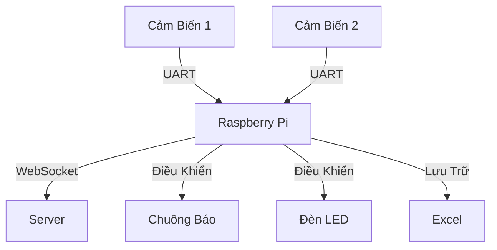

# 🎣 Ứng Dụng Quang Trắc Cá Tầm

<div align="center">
  
</div>

## 📋 Mục Lục
- [Tổng Quan](#-tổng-quan)
- [Tính Năng Chính](#-tính-năng-chính)
- [Cấu Trúc Hệ Thống](#-cấu-trúc-hệ-thống)
- [Cài Đặt](#-cài-đặt)
- [Giao Diện](#-giao-diện)

## 🌟 Tổng Quan
Hệ thống giám sát chất lượng nước trong bể cá tầm, sử dụng các cảm biến để theo dõi và cảnh báo khi có bất thường.

## 🚀 Tính Năng Chính

### 📊 Giám Sát Thời Gian Thực
- Theo dõi dữ liệu từ 2 cảm biến độc lập
- Hiển thị giá trị đo được theo thời gian thực
- Tính toán giá trị trung bình mỗi 10 lần đo

### ⚠️ Hệ Thống Cảnh Báo
- 🔔 Chuông báo khi phát hiện nước đục
- 💡 Đèn LED cảnh báo khi:
  - Pin cảm biến yếu (<15%)
  - Cảm biến mất kết nối
  - Phát hiện nước đục

### 🔄 Xử Lý Dữ Liệu
- Lưu trữ dữ liệu vào Excel theo ngày
- Tự động tính toán giá trị đột biến
- Phát hiện và xử lý mất kết nối

### 🛠️ Quản Lý Thiết Bị
- Cài đặt ngưỡng cảnh báo cho từng cảm biến
- Điều khiển thời gian vệ sinh cảm biến
- Giám sát pin của các cảm biến

### 🌐 Kết Nối
- Giao tiếp UART với các cảm biến
- Kết nối WebSocket với server
- Tự động kết nối lại khi mất kết nối

## 🔧 Cấu Trúc Hệ Thống



## 💻 Giao Diện
- Hiển thị trạng thái cảm biến
- Biểu đồ theo dõi dữ liệu
- Bảng điều khiển cài đặt
- Nút xuất dữ liệu Excel

<div align="center">
  
</div>

## 🔌 Cài Đặt
1. Cài đặt các thư viện cần thiết:

```bash
pip install -r requirements.txt
```

2. Kết nối thiết bị qua cổng USB

3. Chạy chương trình:
```bash
python main.py
```

## 📝 Ghi Chú
- Đường dẫn lưu file: `/home/ailab/Downloads/luu_ca_tam`
- Cổng kết nối mặc định: `/dev/ttyUSB0`


---
<div align="center">
  
  
  
</div>
